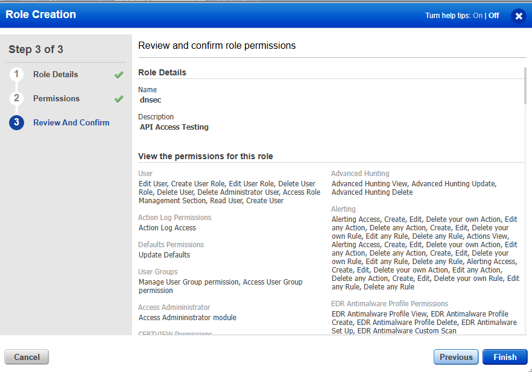
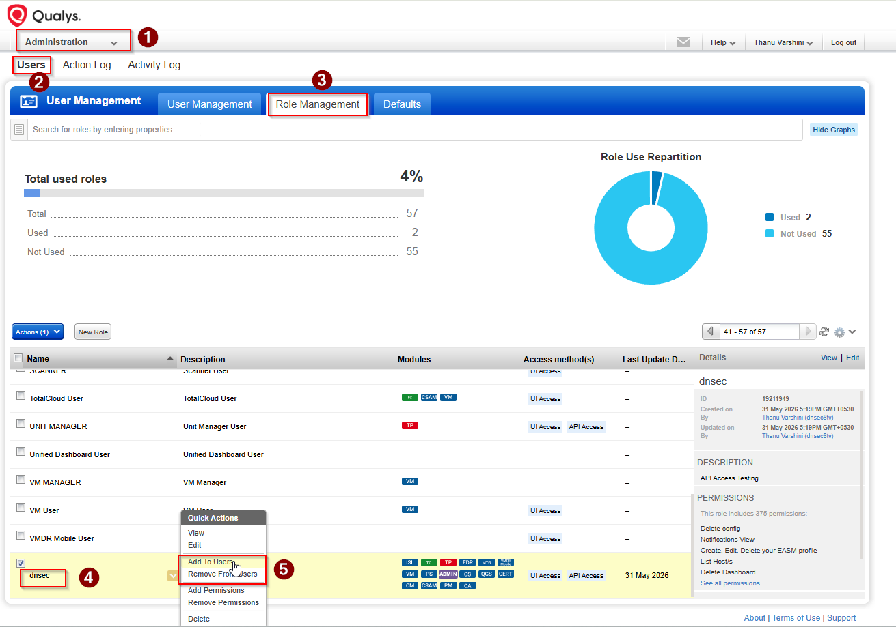
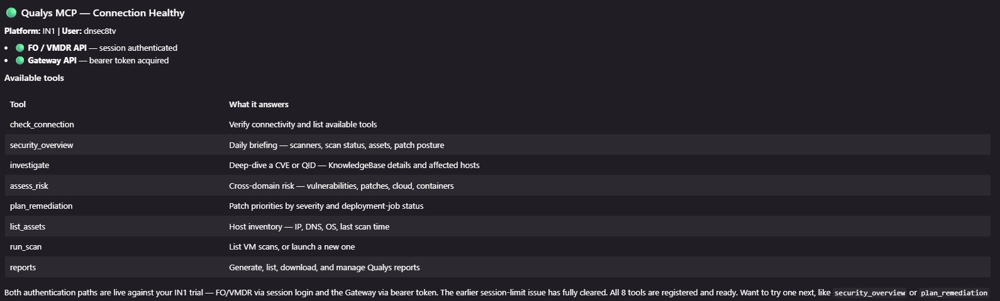

# Qualys MCP

A small [Model Context Protocol](https://modelcontextprotocol.io/) server that
lets an AI agent query Qualys and run scans.

It exposes a handful of **workflow-style tools** — each one pulls from one or
more Qualys APIs and returns a compact, AI-friendly answer instead of raw XML.
It resolves your platform (POD) to both the FO/VMDR base URL and the Gateway
URL, and handles all of Qualys' auth styles automatically. Credentials are read
from the environment, so they never appear in tool calls or chat history.

> Unofficial project. Not affiliated with, endorsed by, or supported by Qualys, Inc.

## How it works

```
MCP client (Kiro / Claude)
        │  stdio
        ▼
qualys_mcp/server.py   ← FastMCP server, defines the workflow tools
        │
        ▼
qualys_mcp/client.py   ← Qualys client (auth, retries, XML/JSON parsing)
        │
        ├──► FO / VMDR API   (session cookie)   — scans, assets, KB, detections
        └──► Gateway API      (bearer token)    — Patch Mgmt, Cloud, Containers
```

Two files do all the work:

| File | Responsibility |
|------|----------------|
| `qualys_mcp/server.py` | Registers the workflow tools and synthesises their responses. |
| `qualys_mcp/client.py` | `QualysClient`: POD resolution, dual auth, retries, and response parsers. |

### Authentication

Qualys uses different auth on different APIs, and this client handles each one:

- **FO / VMDR API** — logs in once (`/api/2.0/fo/session/`) and reuses the
  session cookie. This works even when an account has Basic auth disabled for
  the API (a common security policy).
- **Gateway API** — posts to `/auth` for a bearer JWT, cached and refreshed
  automatically.

`check_connection` reports both paths independently, so you can immediately see
which modules your subscription exposes.

## Tools

| Tool                | What it answers                                                       |
|---------------------|----------------------------------------------------------------------|
| `check_connection`  | Verify connectivity and list available tools (run this first)        |
| `security_overview` | Daily briefing — scanners, scan status, assets, patch posture        |
| `investigate`       | Deep-dive a CVE or QID — KnowledgeBase details and affected hosts     |
| `assess_risk`       | Cross-domain risk — vulnerabilities, patches, cloud, containers      |
| `plan_remediation`  | Patch priorities by severity and deployment-job status               |
| `list_assets`       | Host inventory — IP, DNS, OS, last scan time                         |
| `run_scan`          | List VM scans, or launch a new one                                   |
| `reports`           | Generate, list, download, and manage Qualys reports                  |

### Key parameters

- **investigate** — `target` (CVE ID or QID), `limit`
- **assess_risk** — `scope`: `all` / `vulns` / `patches` / `cloud` / `containers`
- **plan_remediation** — `platform`: `Windows` / `Linux` / `Mac`, optional `severity`
- **security_overview** — `quick`: fast snapshot vs full briefing
- **run_scan** — `action`: `list` / `launch`; for launch: `title`, `ip`, `option_profile_id`
- **reports** — `action`: `list` / `templates` / `launch` / `fetch` / `delete`; `report_id`, `template_id`, `output_format`

## Prerequisites

- Python 3.10+
- A Qualys account with API access
- Your Qualys platform (POD), e.g. `US2` / `IN1`, or an explicit API base URL
- Network access from this host to the Qualys API

## Setup

```powershell
python -m venv .venv
.\.venv\Scripts\Activate.ps1
pip install -r requirements.txt
```

Quick check that it starts (Ctrl+C to stop — it waits silently for a client):

```powershell
python -m qualys_mcp
```

## Configuration

The server reads these environment variables:

| Variable | Required | Description |
|----------|----------|-------------|
| `QUALYS_USERNAME` | yes | Qualys username (your console login). |
| `QUALYS_PASSWORD` | yes | Qualys password. |
| `QUALYS_POD` | yes* | Platform code: `US1`–`US4`, `EU1`–`EU3`, `IN1`, `CA1`, `AE1`, `UK1`, `AU1`, `KSA1`. |
| `QUALYS_BASE_URL` | yes* | Explicit FO/VMDR API URL. Overrides `QUALYS_POD`. |
| `QUALYS_GATEWAY_URL` | no | Explicit Gateway URL. Normally derived from `QUALYS_POD`. |
| `QUALYS_SSL_VERIFY` | no | Set to `false` to disable TLS verification for self-signed certs (default `true`). |
| `QUALYS_TIMEOUT` | no | Request timeout in seconds (default 30). |
| `QUALYS_MAX_RETRIES` | no | Retry attempts on rate limit / transient errors (default 3). |

\* Provide either `QUALYS_POD` or `QUALYS_BASE_URL`.

Not sure which POD you are on? See Qualys'
[platform identification](https://www.qualys.com/platform-identification/) page.

## Enable API access (Qualys side)

The account needs **API access** before any tool will authenticate. On many
subscriptions a Manager-role user has this by default; if not, create a role
with API access and assign it to your user.

1. In the **Administration** module, create a role (here named `dnsec`) and
   confirm its permissions.

   

2. Under **Administration → Users → Role Management**, select the role and use
   **Add to Users** to assign it to your API user. Make sure the role's access
   methods include **API Access**.

   

> Use your normal console username and password — Qualys' API authenticates with
> the same credentials, there is no separate API key.

## Connect a client

This repo ships an `mcp.example.json` with placeholder credentials. Copy it to
`mcp.json`, fill in your real username, password, POD, and the absolute `cwd`
path to this folder, then point your client at it. `mcp.json` is gitignored, so
your real credentials never get committed.

```powershell
copy mcp.example.json mcp.json
```

### Kiro

Use the block from `mcp.example.json` in `.kiro/settings/mcp.json` (workspace)
or `~/.kiro/settings/mcp.json` (user), with your real values:

```json
{
  "mcpServers": {
    "qualys-mcp": {
      "command": "python",
      "args": ["-m", "qualys_mcp"],
      "cwd": "C:\\path\\to\\Mr.D_Qualys_MCP",
      "env": {
        "PYTHONUNBUFFERED": "1",
        "PYTHONDONTWRITEBYTECODE": "1",
        "QUALYS_USERNAME": "your-qualys-user",
        "QUALYS_PASSWORD": "your-qualys-password",
        "QUALYS_POD": "US2"
      },
      "disabled": false,
      "autoApprove": ["check_connection", "security_overview"]
    }
  }
}
```

Then reload, switch the agent to agent mode, and ask it to run
`check_connection` to confirm the link. A healthy connection looks like this —
both auth paths green, followed by the tool list:



Notes:
- `disabled` and `autoApprove` are Kiro-only keys.
- If `python` isn't the right command on that machine, use `py` or the full path to `python.exe`.
- Keep `run_scan` and `reports` out of `autoApprove` so real actions need a click.

## Example prompts

Once connected, just talk to the agent in plain language — it picks the right tools:

```
Run check_connection and tell me which platform and modules I'm on.
Give me a security overview.
What should we patch first on Windows?            → plan_remediation
What's our overall risk?                          → assess_risk(scope="all")
How's our cloud security?                         → assess_risk(scope="cloud")
Tell me about CVE-2024-3400 and who's affected.   → investigate
List my host assets.                              → list_assets
Show me any scans that are Running or in Error.   → run_scan(action="list")
List my Qualys reports.                           → reports(action="list")
Show my scan report templates.                    → reports(action="templates")
Generate a PDF report from template 123456.       → reports(action="launch", template_id="123456")
Download report 987654.                           → reports(action="fetch", report_id="987654")
```

### Ready-to-use prompts

Two copy-paste prompts to try first.

**1. Connection check + tool list**

```
Using the Qualys MCP, run check_connection. Show me the connection status
(healthy/green or not connected/red), the platform and user, both auth paths
(FO and Gateway), and the full list of available tools in the aligned table.
```

**2. Live VMDR assessment of a Cloud Agent host (risk-focused summary)**

Point it at a host enrolled via the Qualys Cloud Agent (replace the name/IP with
your own asset):

```
Using the Qualys MCP, give me a vulnerability assessment of my own machine —
the Qualys Cloud Agent host "dnsoc" (IP 192.168.1.7).

Steps:
1. Run check_connection first.
2. Confirm the asset: run list_assets and find the host "dnsoc" / 192.168.1.7.
3. Pull its vulnerabilities with assess_risk(scope="vulns") and the host
   detections for that IP. Also run plan_remediation for Windows to tie the
   findings to missing patches.

Then give me a summarized report in two parts:

A) FINDINGS — a complete table of every vulnerability detected: severity
   (Critical→Info), QID, title, and CVE if any. Don't omit anything; include a
   severity count summary at the top.

B) WHERE TO FOCUS — don't just repeat the list. For the notable findings, assess
   risk, threat (how it could be exploited), and impact, then tell me the few
   issues that genuinely need fixing first and why, mapped to the missing patches
   that remediate them. Keep it short and decision-oriented — fix-now vs. can-wait.
```

> A freshly enrolled Cloud Agent appears in `list_assets` quickly, but Qualys
> needs time after the first check-in to finish its initial assessment — so the
> vulnerability list may be thin for the first 15–60 minutes. Re-run once it has
> assessed.

## Security

- Credentials are read from environment variables, never from tool arguments.
- `.gitignore` keeps your real `mcp.json` (and `.env`) out of version control;
  commit `mcp.example.json` with placeholders instead.
- `run_scan` with `action="launch"` performs a real scan — keep it out of
  `autoApprove` so it always requires explicit approval.
- API calls use HTTPS with TLS verification on by default.

## Notes

- Workflow tools degrade gracefully: if one Qualys module isn't enabled on your
  subscription, that section reports an error while the rest still returns data.
- Patch Management, Cloud, and Container data come from the Gateway API; scans,
  assets, KnowledgeBase, and detections come from the FO/VMDR API.
